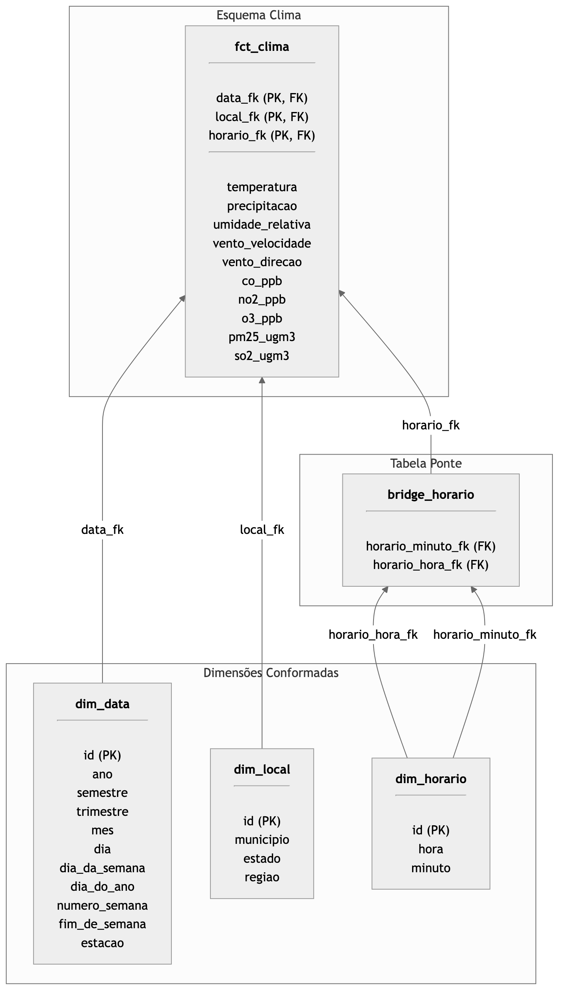
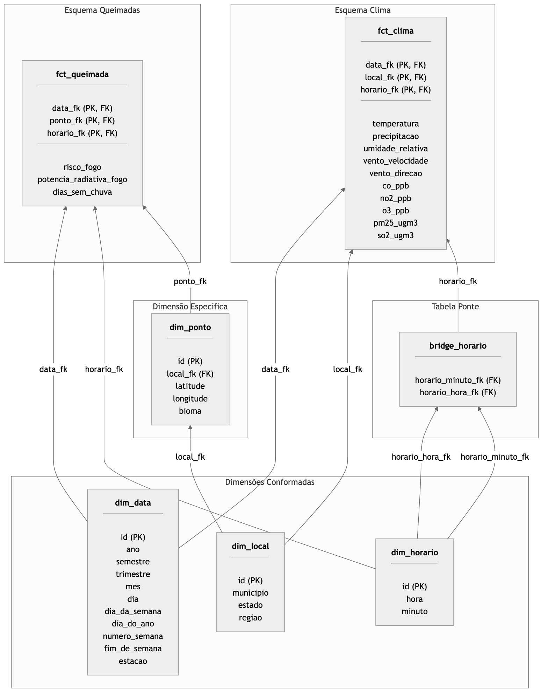

<!-- _class: lead -->
# **As Cinzas do Brasil**
## Análise Multidimensional de Queimadas

### Primeiro Trabalho Prático

**Clara Ernesto de Carvalho** • 14559479
**Felipe Carneiro Machado** • 14569373
**Lívia Lelis** • 12543822

Profa. Cristina Dutra de Aguiar
Outubro de 2025

---

## Contexto do Problema

**30,8 milhões de hectares** queimados no Brasil em 2024
- Área maior que toda a Itália

**Objetivo**: Criar um Data Warehouse para análise de:
- Correlações entre queimadas e clima
- Padrões espaciais e temporais
- Impactos na qualidade do ar

---

## Volume de Dados

**Grande volume de dados**:
- Queimadas: **17.542.900 tuplas** (desde 2003)
- Clima: **158.705.816 tuplas** (desde 2000)
- Total: **+15 GB**

---

## Fontes de Dados

### **Queimadas - INPE**
- Focos de incêndio detectados por satélite
- Localização geográfica (lat/long), bioma
- FRP, dias sem chuva, risco de fogo

### **Clima - SISAM/INPE**
- Dados meteorológicos e qualidade do ar
- Temperatura, umidade, precipitação
- Poluentes: PM2.5, CO, NO₂, O₃, SO₂

---

## Fontes de Dados

### **Geográficos - IBGE**
- Diretórios de UFs e municípios
- Hierarquias administrativas e regiões

---

## Processos de Negócio

### **1. Monitoramento de Focos de Incêndio**
- **Grão**: Um foco por ponto geográfico e minuto
- **Fatos**: FRP (aditivo), dias sem chuva (semi-aditivo), risco (não-aditivo)
- **Uso**: Combate ao fogo, fiscalização, políticas de prevenção

---

## Processos de Negócio (cont.)

### **2. Monitoramento de Condições Climáticas**
- **Grão**: Medições por município e hora
- **Fatos**: Temperatura, umidade, precipitação, poluentes
- **Uso**: Análise de fatores propícios a queimadas, saúde pública

### **3. Análise de Correlação Queimadas-Clima**
- **Integração** via dimensões conformadas
- **Uso**: Validação de hipóteses, modelos preditivos

---

## Modelo Dimensional: Dimensões Conformadas

### **dim_data** (Temporal)
```
dia → mês → trimestre → semestre → ano
+ estação, dia_da_semana, fim_de_semana
```

### **dim_local** (Geográfica - Município)
```
município → estado → região
```

### **dim_horario** (Hora do Dia)
```
minuto → hora
```

---

## Dimensão Específica: Queimadas

### **dim_ponto** (Ponto Geográfico)
```
ponto → município → estado → região
```

**Atributos**:
- Latitude, longitude
- **Bioma** (Amazônia, Cerrado, Mata Atlântica, etc.)
- Referência para `dim_local` (hierarquia estendida)

---

## Importância da Dimensão de Ponto

- Análises por tipo de ecossistema
- Estratégias diferenciadas por bioma
- Priorização de unidades de conservação

---

## Esquema Estrela: Queimadas


**Grão**: Um foco de incêndio por ponto geográfico e minuto

---

## Esquema Estrela: Clima



**Grão**: Medições climáticas agregadas por município e hora

---

## Constelação de Fatos



---

## Tabela Ponte: bridge_horario

### **Problema**: Granularidades Diferentes
- Queimadas: grão de **minuto** (ex: foco às 14:23)
- Clima: grão de **hora** (ex: condições 14:00-14:59)

### **Solução**: Tabela Ponte
- Mapeamento **60:1** (cada hora → 60 minutos)
- Permite **drill-across** entre fatos
- Integração consistente sem duplicação

---

## Exemplo de Uso da Tabela Ponte

Focos detectados às 14:23, 14:37, 14:54
- Agregados para hora 14:00
- Correlação com temperatura e PM2.5 da hora 14:00

---

## Processo de Projeto da Constelação

### **Etapa 1**: Identificação dos Processos de Negócio
- Monitoramento de queimadas
- Monitoramento climático

### **Etapa 2**: Projeto dos Esquemas Estrela
- Definição de grãos e métricas
- Esquemas independentes

---

## Processo de Projeto (cont.)

### **Etapa 3**: Conformação de Dimensões
- `dim_data`, `dim_local`, `dim_horario` compartilhadas
- Garantia de consistência semântica

### **Etapa 4**: Resolução de Granularidades
- Introdução da `bridge_horario`
- Suporte a análises multi-granularidade

---

## Consultas OLAP: Drill-Down

### **Visão Geral → Específica**
```
Focos por Estado por Ano
    ↓ [drill-down na hierarquia geográfica]
Focos por Município por Ano
```

**Importância**:
- Identificar municípios críticos dentro de estados problemáticos
- Direcionar brigadas e fiscalização IBAMA
- Comparar tendências ano-a-ano

**Exemplo**: Mato Grosso tem alta incidência → quais municípios?

---

## Consultas OLAP: Roll-Up

### **Específico → Visão Macro**
```
Precipitação por Estado por Mês
    ↑ [roll-up em ambas hierarquias]
Precipitação por Região por Ano
```

**Importância**:
- Identificar tendências climáticas de longo prazo
- Detectar mudanças climáticas regionais
- Planejamento estratégico nacional
- Suavizar ruído estatístico

---

## Consultas OLAP: Pivot

### **Mudança de Perspectiva**
```
Potência Radiativa por Estado × Mês
    ↻ [pivot - reorientação]
Potência Radiativa por Mês × Estado
```

**Uso**:
- **Original**: "Como variam queimadas em SP ao longo do ano?"
- **Pivotada**: "Quais estados mais sofrem em Setembro?"

---

## Benefício do Pivot

**Mesmos dados, perguntas diferentes**
- Gestores estaduais → quando intensificar ações
- Coordenação federal → para onde direcionar recursos

---

## Consultas OLAP: Slice

### **Isolamento de uma Dimensão**
```
Precipitação por Estado por Mês
    [slice: mês = Setembro]
Precipitação por Estado para Setembro
```

**Justificativa**:
- Setembro = final da estação seca
- Período crítico para queimadas
- Análise focada em momento mais relevante

**Aplicação**: Identificar estados com déficit hídrico severo
→ Priorizar recursos de prevenção

---

## Consultas OLAP: Dice

### **Corte Multi-dimensional**
```
Poluentes por Município × Dia × Hora
    [dice: Norte + Jul-Set + 12h-18h]
PM2.5, CO, O₃ - Norte, Jul-Set, 12h-18h
```

**Isolamento Simultâneo**:
- **Geográfico**: Região Norte (Amazônia)
- **Temporal**: Julho-Setembro (seca)
- **Horário**: 12h-18h (pico térmico)

---

## Importância do Dice

Identificar **situação mais crítica**:
- Alertas de saúde para grupos de risco
- Previsão de demanda hospitalar
- Evidências para políticas ambientais

---

## Consultas OLAP: Drill-Across

### **Integração Cross-Fact**
```
[Umidade por Região × Trimestre] (Clima)
          + 
[Potência Radiativa por Região × Trimestre] (Queimadas)
          =
Correlação Umidade ↔ Intensidade de Queimadas
```

---

## Poder das Dimensões Conformadas

- Mesma semântica: "Região Norte" = "Região Norte"
- Mesma temporalidade: "3º Trimestre 2024" consistente
- Bridge resolve granularidades diferentes

**Aplicações**:
- Validação de hipóteses científicas
- Alimentar modelos de machine learning
- Justificar alocação orçamentária

---

## Análise por Bioma

### **Drill-Down com Dimensão Adicional**
```
Risco de Fogo por Estado
    ↓ [drill-down + bioma]
Risco por Município × Bioma
```

---

## Importância da Análise por Bioma

| Bioma | Características | Impacto |
|-------|----------------|---------|
| Amazônia | Biodiversidade alta | Emissões CO₂ críticas |
| Cerrado | Vegetação propícia ao fogo | 2º mais afetado |
| Pantanal | Devastação em 2020 | Monitoramento prioritário |

**Municípios podem ter múltiplos biomas** → Estratégias diferenciadas

---

## Análise Temporal: Bridge Table

### **Padrões Circadianos de Queimadas**
```
Contagem de Focos por Município × Hora
     +
Temperatura e PM2.5 por Município × Hora
```

---

## Funcionamento da Ponte

1. Focos detectados: 14:23, 14:37, 14:54
2. Bridge agrega: 3 focos na hora 14:00
3. Correlação com clima da hora 14:00

**Insights**:
- Horários de pico de incidência (tarde)
- Impacto imediato na qualidade do ar
- Dimensionamento de equipes por turno

---

<!-- _class: lead -->

# Obrigado!

## Perguntas?