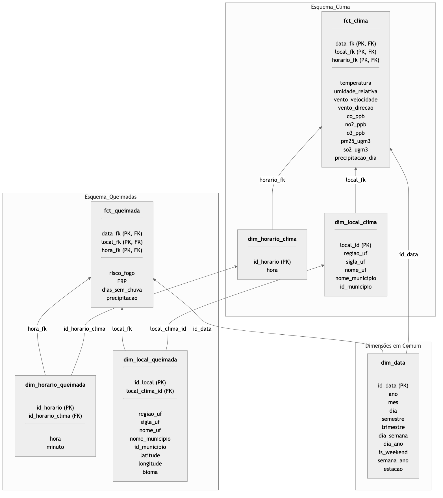

# Cinzas do Brasil

Projeto final da Disciplina Processamento Analítico de Dados
Realizado por:
Felipe Carneiro Machado - 14569373
Lívia Lelis - 12543822
Clara Ernesto de Carvalho - 14559479

---

# Objetivo

- Consolidação de dados do INPE (Instituto Nacional de Pesquisas Espaciais) relativos a focos de queimadas e clima
- Criação de um Data Warehouse com dados históricos (desde 2005 (alguém corrige essa data))
- Geração de visualizações baseadas em consultas analíticas para tomada estratégica de decisões

---

# Visão geral da Arquitetura

Vai ter um diagrama aqui (ta quase feito, falta definir so o de visualizacao)

---

# Organização do Data Warehouse

Constelação de fatos corrigida

<ul>
<li>Remoção da tabela bridge</li>
<li>Dimensão Data conformada</li>
<li>Dimensões horário e local do esquema Queimada (granularidade mais fina) possuem Chaves Estrangeiras para as mesmas dimensões no esquema Clima (granularidade mais grossa)</li>
</ul>

---

# Extração dos Dados

Foram utilizadas 4 fontes:

- Dataset de focos de queimadas do INPE -> extraído diretamente do BigQuery

- Dataset de dados climáticos do SISAM -> extraído diretamente do BigQuery

- Relação de munícipios e seus códigos pelo IBGE -> CSV obtido de fontes públicas

- Relação de estados e as regiões às quais pertencem -> CSV obtido de fontes públicas

---

# Transformação

Pré-processamento dos dados:

- Tratamento de valores faltantes
- Computação de atributos derivados (ex: estação do ano)
- Atribuição de tipos de dados corretos

---

# Transformação

Criação de dimensões e tabelas de fatos:

- Dimensão Data gerada a partir de união e projeção das tabelas de Queimadas e Clima
- Dimensões Local geradas a partir da junção e projeção de cada tabela com as relações de Municípios e regiões
- Dimensão Horário preenchida proceduralmente com todos os valores de horas e minutos
- Chaves Estrangeiras das tabelas de fatos preenchidas através de junção com as tabelas de dimensões

---

# Carregamento

Dados carregados em um RSGBD (PostgreSQL)

Indíces criados para colunas de frequente acesso:

- Chaves estrangeiras nas tabelas de fatos e dimensões do esquema Queimadas
- Timestamp, Mes e ano para Data
- Hora para Horário
- UF e município para Local

---

# Consultas analíticas e visualização

- Consultas implementadas em SQL
- Visualizações construídas com (SOFTWARE Q A CLARA ESCOLHER)
