# **Cinzas do Brasil**

## Análise Multidimensional de Dados de Queimadas

Projeto final da Disciplina Processamento Analítico de Dados
Realizado por:
Felipe Carneiro Machado - 14569373
Lívia Lelis - 12543822
Clara Ernesto de Carvalho - 14559479

---

## Contexto do Problema

**30,8 milhões de hectares** queimados no Brasil em 2024

- Área maior que toda a Itália

**Objetivo**: Criar um Data Warehouse para análise de:

- Correlações entre queimadas e clima
- Padrões espaciais e temporais
- Impactos na qualidade do ar

---

## Fontes de Dados

### **Queimadas - INPE**

- Focos de incêndio detectados por satélite
- Localização geográfica (lat/long), bioma
- FRP, dias sem chuva, risco de fogo

### **Clima - SISAM/INPE**

- Dados meteorológicos e qualidade do ar
- Temperatura, umidade, precipitação
- Poluentes: PM2.5, CO, NO₂, O₃, SO₂

---

## Fontes de Dados

### Problema com horários

O Dataset de Clima possui dados apenas coletados com horas 0, 6, 12 e 18.

Sendo assim, quando juntamos os dados de Clima com os de Queimadas, perdemos muitos dados.

Outra opção seria interpolar os dados de Clima para os horários faltantes.

Decidimos manter apenas os horários disponíveis no Dataset de Clima, já que não impactava significativamente a análise.

---

## Fontes de Dados

### **Geográficos - IBGE**

- Diretórios de UFs e municípios
- Hierarquias administrativas e regiões

---

# Objetivo

- Consolidação de dados do INPE (Instituto Nacional de Pesquisas Espaciais) relativos a focos de queimadas e clima
- Criação de um Data Warehouse com dados históricos
- Geração de visualizações baseadas em consultas analíticas para tomada estratégica de decisões

---

# Visão geral da Arquitetura

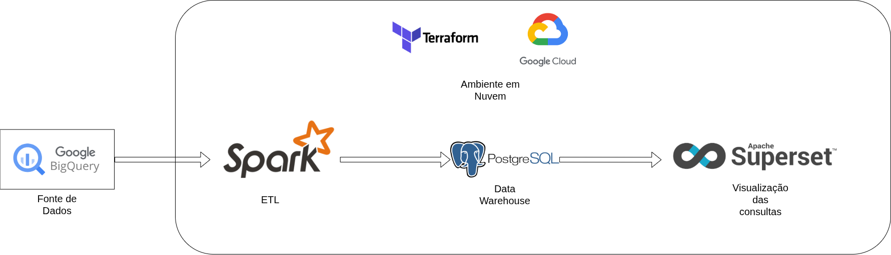

---

# Organização do <br>Data Warehouse

Constelação de fatos corrigida

<ul>
<li>Tabela bridge</li>
<li>Dimensão Data unificada</li>
<li>Dimensões do esquema Queimada possuem Chaves Estrangeiras para as mesmas dimensões no esquema Clima</li>
</ul>


---

# Organização do <br>Data Warehouse

## Queimadas

Esquema estrela corrigido

- Dessa vez, fizemos o esquema estrela sem pensar na posterior unificação

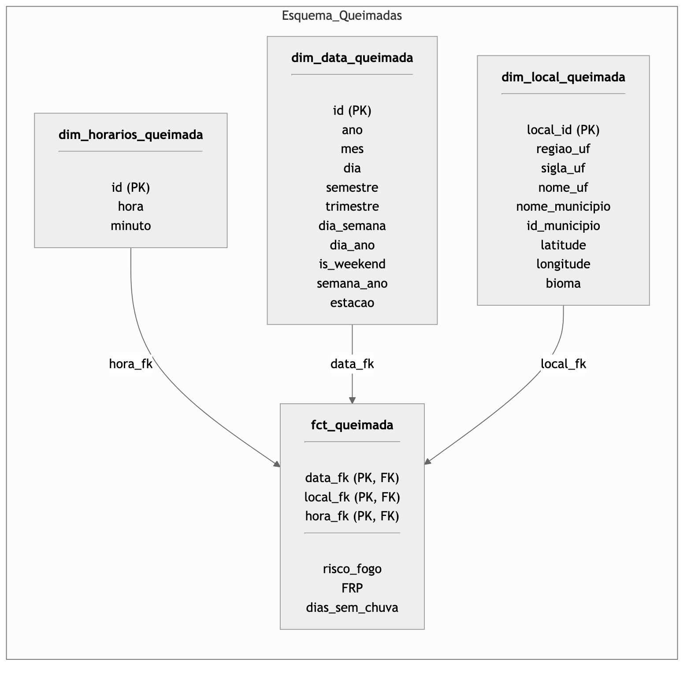

---

# Organização do <br>Data Warehouse

## Clima

Esquema estrela corrigido

- Dessa vez, fizemos o esquema estrela sem pensar na posterior unificação

## 

---

# Infraestrutura

## Provisionamento com Terraform

Provisionamos com Terraform:

- Base de dados PostgreSQL
- Jobs Spark para ETL
- Superset para visualização dos dados

## 

---

# Infraestrutura

## Google Cloud Platform

Conseguimos créditos para estudantes.

Algumas das VMs utilizadas eram Spot, portanto podem ser derrubadas a qualquer momento.

## 

---

# Base de Dados

## PostgreSQL

Utilizamos Citus para armazenamento colunar.

> Ol'reliable

## 

---

# ETL

## Spark

Usamos PySpark para o processo de ETL.
Os Jobs foram configurados com terraform para a Google Cloud Platform.
Utilizamos o serviço Dataproc.

## Polars

Utilizamos polars para o protótipo do ETL, e para testes de validação dos dados.

---

# Extração dos Dados

Foram utilizadas 4 fontes:

- Dataset de focos de queimadas do INPE -> extraído diretamente do BigQuery

- Dataset de dados climáticos do SISAM -> extraído diretamente do BigQuery

- Relação de munícipios e seus códigos pelo IBGE -> CSV obtido de fontes públicas

- Relação de estados e as regiões às quais pertencem -> CSV obtido de fontes públicas

---

# Transformação

Pré-processamento dos dados:

- Tratamento de valores faltantes
- Computação de atributos derivados (ex: estação do ano)
- Atribuição de tipos de dados corretos

---

# Transformação

Criação de dimensões e tabelas de fatos:

- Dimensão Data gerada a partir de união e projeção das tabelas de Queimadas e Clima
- Dimensões Local geradas a partir da junção e projeção de cada tabela com as relações de Municípios e regiões
- Dimensão Horário preenchida proceduralmente com todos os valores de horas e minutos
- Chaves Estrangeiras das tabelas de fatos preenchidas através de junção com as tabelas de dimensões

---

# Carregamento

Dados carregados em um RSGBD (PostgreSQL)

Indíces criados para colunas de frequente acesso:

- Chaves estrangeiras nas tabelas de fatos e dimensões do esquema Queimadas
- Timestamp, Mes e ano para Data
- Hora para Horário
- UF e município para Local

Também podemos carregar em parquets para testes de validação locais.

---

# Consultas analíticas e visualização

- Consultas implementadas em SQL
- Visualizações construídas com Apache Superset

---

# Queimadas por Estado e Municipio

```sql
SELECT DISTINCT
    dim_local_queimada.nome_uf,
    dim_local_queimada.nome_municipio,
    count(*) OVER (PARTITION BY id_municipio) as count_focus_municipio,
    count(*) OVER (PARTITION BY sigla_uf) as count_focus_uf
FROM fct_queimada
        INNER JOIN dim_local_queimada ON fct_queimada.id_local = dim_local_queimada.id_local;
```

---

# Queimadas por Estado e Municipio

| nome_uf           | nome_municipio     | count_focus_municipio | count_focus_uf |
| :---------------- | :----------------- | :-------------------- | :------------- |
| Bahia             | Sento Sé           | 3393                  | 793832         |
| Maranhão          | Raposa             | 25                    | 1662525        |
| Amazonas          | Boa Vista do Ramos | 4507                  | 1415893        |
| Santa Catarina    | Major Vieira       | 410                   | 89056          |
| Pará              | Palestina do Pará  | 664                   | 3711770        |
| Paraná            | Telêmaco Borba     | 119                   | 154345         |
| Maranhão          | Urbano Santos      | 14240                 | 1662525        |
| São Paulo         | Pereiras           | 23                    | 308107         |
| Rio Grande do Sul | São Vendelino      | 50                    | 106181         |
| Minas Gerais      | Natércia           | 12                    | 611748         |

---

# Queimadas por Estado e Municipio

<center>
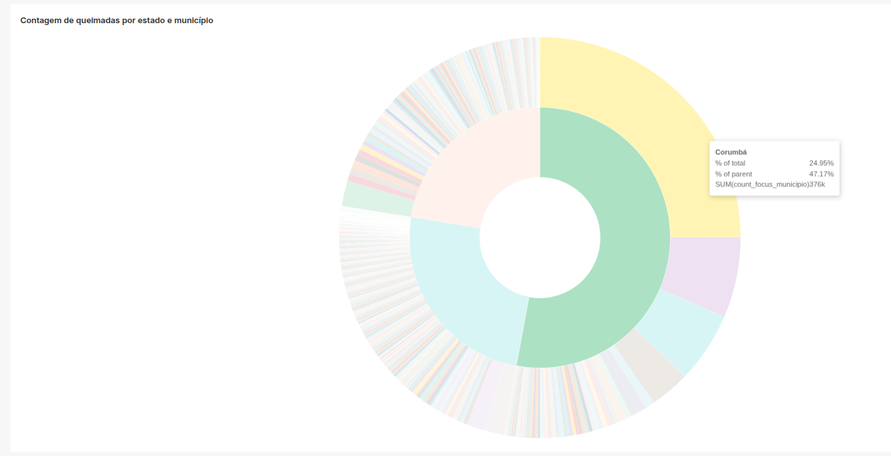
</center>

---

# Risco de Fogo por Bioma e Estado

```sql
SELECT
  dd.ano,
  dlq.bioma,
  dlq.nome_uf,
  avg(fct_queimada.risco_fogo) as media_risco_fogo
FROM fct_queimada
  INNER JOIN dim_data dd on fct_queimada.id_data = dd.id_data
  INNER JOIN dim_local_queimada dlq on fct_queimada.id_local = dlq.id_local
WHERE fct_queimada.risco_fogo is not null
GROUP BY dd.ano, CUBE (dlq.nome_uf, dlq.bioma)
```

---

# Risco de Fogo por Bioma e Estado

| ano  | bioma          | nome_uf             | media_risco_fogo     |
| :--- | :------------- | :------------------ | :------------------- |
| 2023 | Cerrado        | Bahia               | 0.8824044485917271   |
| 2023 | Mata Atlântica | Rio Grande do Norte | 0.909802325581396    |
| 2024 | Amazônia       | Mato Grosso         | 0.8531616825819953   |
| 2024 | Caatinga       | Piauí               | 0.9313792098082525   |
| 2023 | Caatinga       | Minas Gerais        | 0.918389438943894    |
| 2025 | Amazônia       | Acre                | 0.1572789115646258   |
| 2025 | Cerrado        | Mato Grosso         | 0.016822857142857077 |
| 2024 | Amazônia       | Amapá               | 0.7908056120696502   |

---

# Risco de Fogo por Bioma e Estado

<center>
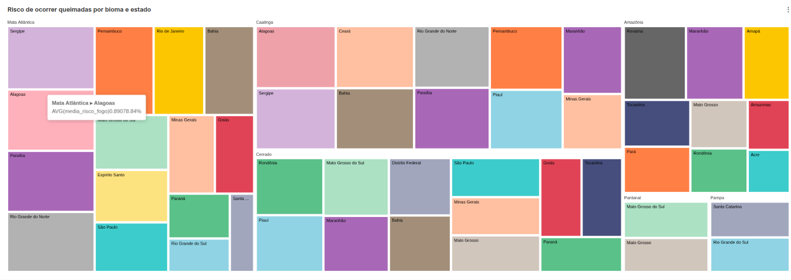
</center>

---

# Risco de Fogo por Estado e Bioma

<center>
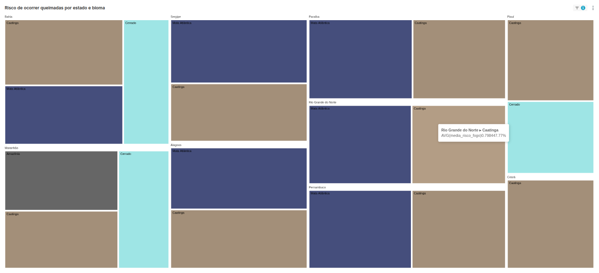
</center>

---

# Focos de Incêndio relacionados à poluição e temperatura, por hora do dia

| nome_uf             | nome_municipio      | count_focus_municipio | count_focus_uf |
| :------------------ | :------------------ | :-------------------- | :------------- |
| Bahia               | Sento Sé            | 3393                  | 793832         |
| Maranhão            | Raposa              | 25                    | 1662525        |
| Amazonas            | Boa Vista do Ramos  | 4507                  | 1415893        |
| Santa Catarina      | Major Vieira        | 410                   | 89056          |
| Pará                | Palestina do Pará   | 664                   | 3711770        |
| Paraná              | Telêmaco Borba      | 119                   | 154345         |
| Maranhão            | Urbano Santos       | 14240                 | 1662525        |
| São Paulo           | Pereiras            | 23                    | 308107         |
| Rio Grande do Sul   | São Vendelino       | 50                    | 106181         |
| Minas Gerais        | Natércia            | 12                    | 611748         |
| Minas Gerais        | Lambari             | 220                   | 611748         |
| Goiás               | Hidrolina           | 487                   | 369727         |
| Rio Grande do Norte | São Bento do Trairí | 25                    | 41777          |

---

```sql
WITH joined_clima AS
         (SELECT
              dlc.id_local,
              dhc.id_horario,
              dlc.nome_municipio,
              dlc.sigla_uf,
              dhc.hora,
              avg(fct_clima.temperatura) AS media_temperature,
              avg(pm25_ugm3) AS media_pm25_ugm3
          FROM fct_clima
                   INNER JOIN public.dim_local_clima dlc ON dlc.id_local = fct_clima.id_local
                   INNER JOIN public.dim_horario_clima dhc ON dhc.id_horario = fct_clima.id_horario
          GROUP BY dlc.id_local, dhc.id_horario, dlc.nome_municipio, dlc.sigla_uf, dhc.hora
         ),
     joined_queimada AS
         (SELECT
              dhq.id_horario_clima,
              dlq.id_local_clima,
              count(*) AS count_focus
          FROM fct_queimada
                   INNER JOIN public.dim_horario_queimada dhq ON fct_queimada.id_horario = dhq.id_horario
                   INNER JOIN public.dim_local_queimada dlq ON dlq.id_local = fct_queimada.id_local
          GROUP BY dhq.id_horario_clima, dlq.id_local_clima
         )
SELECT
    jc.hora,
    (jc.nome_municipio || '/' || jc.sigla_uf) AS nome_municipio,
    jq.count_focus,
    jc.media_pm25_ugm3,
    jc.media_temperature
FROM joined_clima jc
         INNER JOIN joined_queimada jq ON jc.id_local = jq.id_local_clima AND jc.id_horario = jq.id_horario_clima;
```

---

# Focos de Incêndio relacionados à poluição e temperatura, por hora do dia

<center>
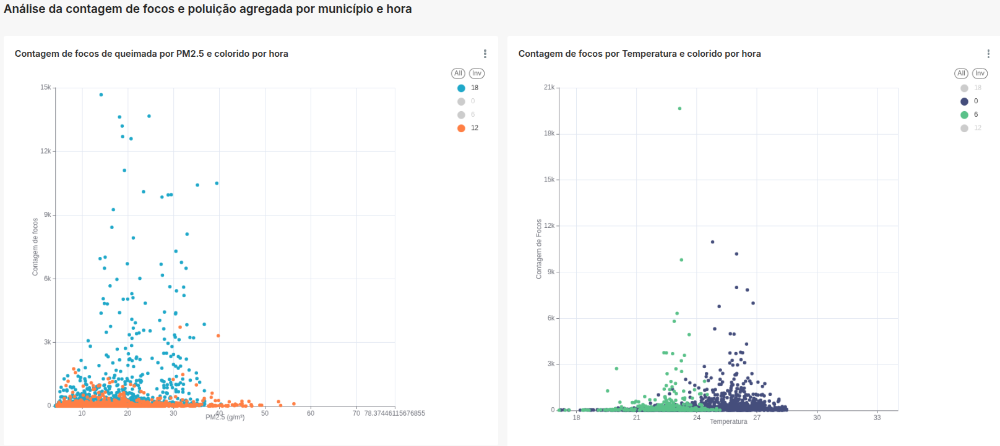
</center>

---

# Potência Radiativa média por Umidade média por Região e Trimestre

| regiao_uf    | trimestre | media_potencia_radiativa_fogo | media_umidade_relativa |
| :----------- | :-------- | :---------------------------- | :--------------------- |
| Sul          | 3         | 14.93016002852389             | 78.32078885708523      |
| Nordeste     | 4         | 43.95912624814175             | 68.69748443032579      |
| Sul          | 4         | 24.745638802647903            | 77.1288658575511       |
| Sudeste      | 2         | 17.759897081895193            | 77.01469390844045      |
| Sul          | 1         | 19.802465331278853            | 80.37956862368847      |
| Centro-Oeste | 2         | 49.15928071566512             | 71.78433590787404      |
| Sudeste      | 4         | 29.698086744974844            | 75.24976807851378      |
| Norte        | 1         | 29.770531719188085            | 88.50501484429284      |
| Centro-Oeste | 3         | 42.16489918359046             | 54.083974791263095     |

---

```sql
WITH joined_clima AS
    (SELECT
         dlc.regiao_uf,
         dd.trimestre,
         avg(fct_clima.umidade_relativa) media_umidade_relativa
     FROM fct_clima
     INNER JOIN public.dim_local_clima dlc on dlc.id_local = fct_clima.id_local
     INNER JOIN public.dim_data dd on fct_clima.id_data = dd.id_data
     GROUP BY dlc.regiao_uf, dd.trimestre
     ),
    joined_queimada AS
    (SELECT
         d.trimestre,
         dlq.regiao_uf,
         avg(fct_queimada.potencia_radiativa_fogo) as media_potencia_radiativa_fogo
     from fct_queimada
     INNER JOIN public.dim_data d on d.id_data = fct_queimada.id_data
     INNER JOIN public.dim_local_queimada dlq on dlq.id_local = fct_queimada.id_local
     GROUP BY d.trimestre, dlq.regiao_uf
     )
SELECT
    jc.regiao_uf,
    jc.trimestre,
    jq.media_potencia_radiativa_fogo,
    jc.media_umidade_relativa
FROM joined_clima jc
  INNER JOIN joined_queimada jq ON jc.regiao_uf = jq.regiao_uf AND jc.trimestre = jq.trimestre
```

---

# Potência Radiativa média por Umidade média por Região e Trimestre

<center>
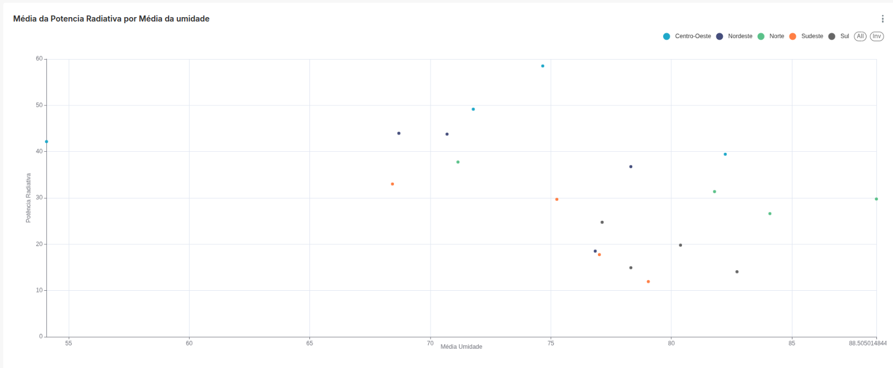
</center>

---

# Potência Radiativa média e Umidade média por Trimestre e Região

<center>
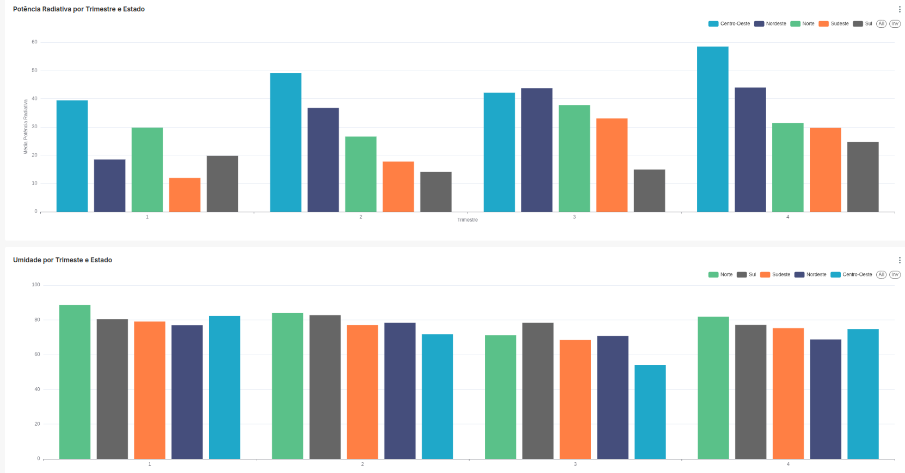
</center>

---

# Potência Radiativa por Mês e Estado

```sql
SELECT
    dl.nome_uf,
    dd.mes,
    avg(fct_queimada.potencia_radiativa_fogo) as media_potencia
FROM fct_queimada
  INNER JOIN public.dim_local_queimada dl ON fct_queimada.id_local = dl.id_local
  INNER JOIN public.dim_data dd ON fct_queimada.id_data = dd.id_data
WHERE fct_queimada.potencia_radiativa_fogo is not null
GROUP BY (dl.nome_uf, dd.mes);
```

---

# Potência Radiativa por Mês e Estado

| nome_uf             | mes | media_potencia     |
| :------------------ | :-- | :----------------- |
| Mato Grosso         | 7   | 50.06269768357538  |
| Rio de Janeiro      | 12  | 24.77670068027211  |
| Rio Grande do Norte | 10  | 26.767140077820997 |
| Acre                | 5   | 7.59251870324189   |
| Paraná              | 6   | 16.436818095419095 |
| Goiás               | 3   | 23.517599677809038 |
| Rondônia            | 4   | 6.954545454545454  |
| São Paulo           | 7   | 32.97998578311361  |
| Piauí               | 7   | 39.99880110480477  |
| Acre                | 10  | 25.94986159897682  |
| Distrito Federal    | 12  | 5.155              |
| Paraíba             | 9   | 32.2182002314814   |

---

# Potência Radiativa por Mês com filtro para Estado

<center>
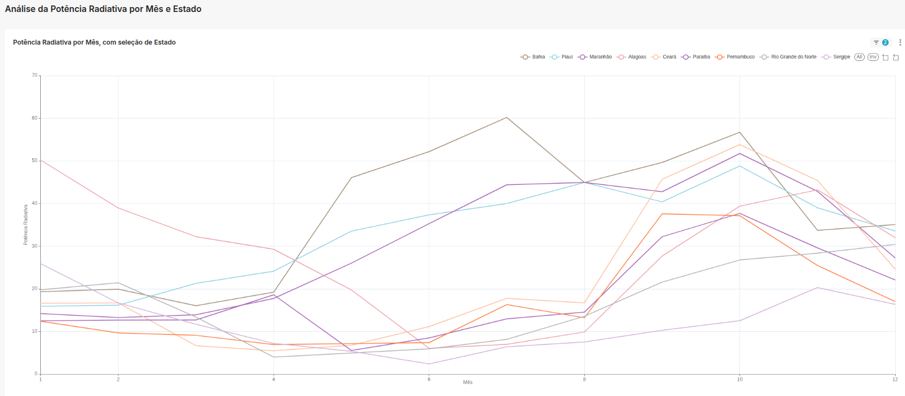
</center>

---

# Potência Radiativa por Estado com filtro para Mês

<center>
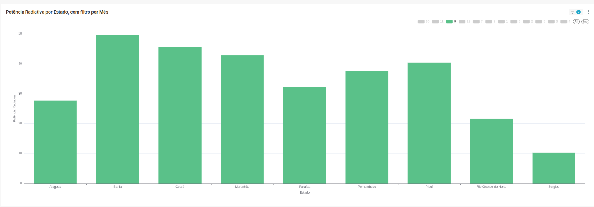
</center>

---

# Precipitação por Estado no Mês de Setembro

```sql
SELECT
    dd.mes,
    dlc.nome_uf,
    avg(fct_clima.precipitacao_dia) as media_precipitacao
FROM fct_clima
  INNER JOIN public.dim_data dd on dd.id_data = fct_clima.id_data
  INNER JOIN public.dim_local_clima dlc on dlc.id_local = fct_clima.id_local
WHERE dd.mes = 9
GROUP BY (dd.mes, dlc.nome_uf)
ORDER BY media_precipitacao DESC;
```

---

# Precipitação por Estado no Mês de Setembro

| mes | nome_uf            | media_precipitacao |
| :-- | :----------------- | :----------------- |
| 9   | Rio Grande do Sul  | 5.152203219315895  |
| 9   | Santa Catarina     | 5.031276836158192  |
| 9   | Paraná             | 3.659895572263993  |
| 9   | Roraima            | 3.157              |
| 9   | Amazonas           | 2.964731182795699  |
| 9   | Acre               | 2.7641666666666667 |
| 9   | Mato Grosso do Sul | 2.504367088607595  |
| 9   | Rondônia           | 2.5016346153846154 |
| 9   | São Paulo          | 2.113              |
| 9   | Rio de Janeiro     | 1.9678442028985508 |

---

# Precipitação por Estado no Mês de Setembro

<center>
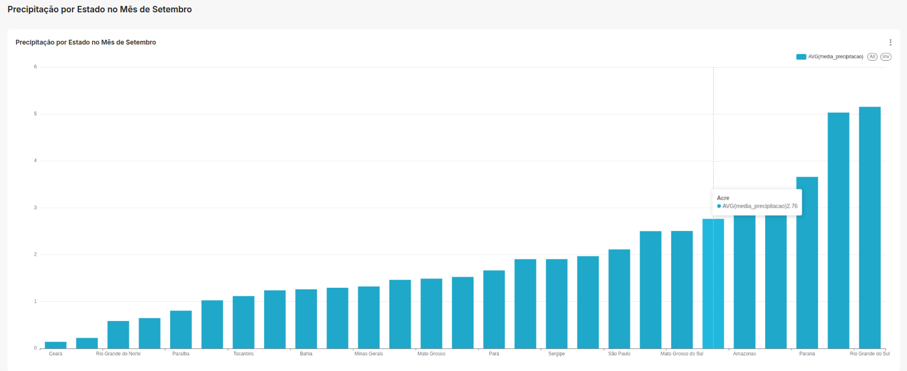
</center>

---

# Qualidade do ar na região Norte na época de secas

```sql
SELECT
    dd.dia_ano,
    dlc.nome_municipio,
    avg(fct_clima.co_ppb) as media_co_ppb,
    avg(fct_clima.pm25_ugm3) as media_pm25_ugm3,
    avg(fct_clima.o3_ppb) as media_o3_ppb
FROM fct_clima
    JOIN public.dim_data dd on dd.id_data = fct_clima.id_data
    JOIN public.dim_local_clima dlc on fct_clima.id_local = dlc.id_local
WHERE dd.mes >6 AND dd.mes < 10 AND regiao_uf = 'Norte'
GROUP BY dd.dia_ano, dlc.nome_municipio;
```

---

# Qualidade do ar na região Norte na época de secas

| dia_ano | nome_municipio         | media_co_ppb       | media_pm25_ugm3    | media_o3_ppb       |
| :------ | :--------------------- | :----------------- | :----------------- | :----------------- |
| 273     | Abaetetuba             | 126.5364864864865  | 16.33888888888889  | 22.98918918918919  |
| 182     | Paragominas            | 105.7703703703704  | 8.521153846153847  | 12.798148148148151 |
| 238     | Trairão                | 296.8094594594594  | 42.1513888888889   | 12.963513513513517 |
| 205     | Ananás                 | 159.78243243243244 | 9.97605633802817   | 16.759459459459446 |
| 220     | Abel Figueiredo        | 178.3148648648649  | 15.027631578947373 | 17.68648648648648  |
| 261     | Fonte Boa              | 186.30810810810817 | 16.570666666666668 | 8.704054054054051  |
| 241     | Uiramutã               | 111.07702702702704 | 14.505555555555556 | 10.74459459459459  |
| 194     | Vilhena                | 234.28108108108108 | 103.85263157894738 | 11.532432432432438 |
| 215     | Magalhães Barata       | 88.17432432432435  | 7.882894736842106  | 20.751351351351357 |
| 266     | Mazagão                | 107.36216216216215 | 10.719444444444447 | 21.093243243243236 |
| 190     | Moju                   | 105.6945945945946  | 12.963157894736838 | 15.00945945945946  |
| 262     | Campo Novo de Rondônia | 1808.2702702702707 | 225.7736111111111  | 20.451351351351363 |

---

# Qualidade do ar na região Norte na época de secas

<center>
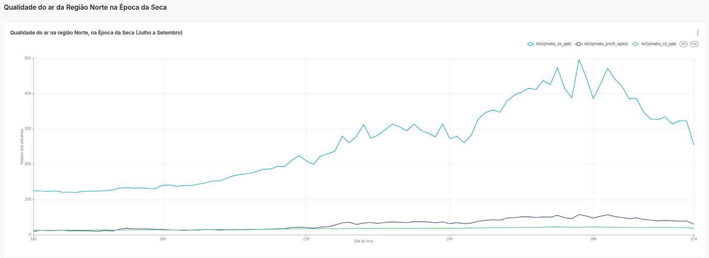
</center>

---

# RollUp Precipitação média por Ano, Região, mês e Estado

```sql
SELECT
    dd.ano,
    dd.mes,
    dl.nome_uf,
    dl.regiao_uf,
    avg(fct_clima.precipitacao_dia) as media_precipitacao

FROM fct_clima
    INNER JOIN dim_data dd on dd.id_data = fct_clima.id_data
    INNER JOIN dim_local_clima dl on dl.id_local = fct_clima.id_local
GROUP BY ROLLUP
    ((dd.ano, dl.regiao_uf),(dl.nome_uf, dd.mes))
```

---

# RollUp Precipitação média por Ano, Região, mês e Estado

| ano  | mes  | nome_uf           | regiao_uf    | media_precipitacao  |
| :--- | :--- | :---------------- | :----------- | :------------------ |
| null | null | null              | null         | 3.4866503356336795  |
| 2017 | 7    | São Paulo         | Sudeste      | 0.07176794198549638 |
| 2015 | 5    | Amapá             | Norte        | 7.189516129032258   |
| 2013 | 12   | Rio de Janeiro    | Sudeste      | 8.447405329593268   |
| 2018 | 9    | Amapá             | Norte        | 1.9                 |
| 2007 | 9    | Rio Grande do Sul | Sul          | 6.345070422535211   |
| 2007 | 1    | Goiás             | Centro-Oeste | 8.368738526094939   |
| 2003 | 1    | São Paulo         | Sudeste      | 11.421355338834708  |
| 2005 | 8    | Roraima           | Norte        | 4.313978494623656   |
| 2003 | 2    | Minas Gerais      | Sudeste      | 2.2778010383520346  |
| 2013 | 10   | Amapá             | Norte        | 1.8205645161290323  |
| 2008 | 9    | Espírito Santo    | Sudeste      | 1.2837606837606839  |

---

# RollUp Precipitação média por Ano, Região, mês e Estado

Não conseguimos pensar em uma visualização adequada, por causa da mudança de granularidade em múltiplas dimensões.

---

# Conclusões

- Correlações identificadas entre dados de queimadas e clima (Ex: FRP x Umidade)

- Identificação de biomas e estado em maior risco de focos de incêndios, além de estados e cidades com maior incidência

- Análise de comportamentos específicos para cada estado quanto a intensidade de queimadas

---

# Referências

- [Google Cloud Platform](https://bombatec.com.br/shop/manufacturer-site?&transition=top97566919052470)
- [Terraform](https://developer.hashicorp.com/terraform)

---

# Código Fonte

## [Github](https://github.com/clr-cera/olap2025.2)

## 

---

# **Perguntas?**

```
(U ﹏ U)
```

## 
